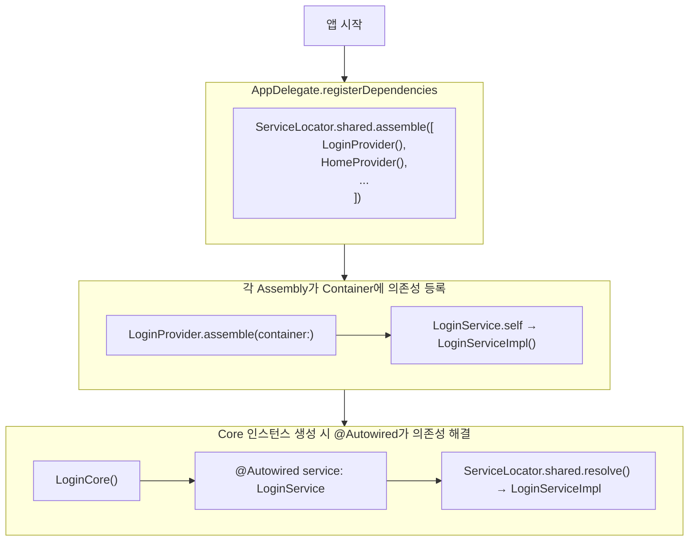

# CoreFlow 의존성 주입(DI) 가이드

CoreFlow는 ServiceLocator 패턴과 `@Autowired` 프로퍼티 래퍼를 통해 의존성 주입을 지원합니다.
Swinject 라이브러리를 기반으로 하며, CoreFlow를 import하면 Swinject의 타입들을 직접 사용할 수 있습니다.
CoreFlow의 의존성 주입 방식을 이해하기 전 Swinject의 기능에 대한 이해가 선행되어야 합니다.

# 구성요소 설명

## ServiceLocator

### 책임

- 의존성 컨테이너 관리: Swinject Container를 내부적으로 관리하며, 의존성 등록 및 해결을 담당합니다.
- 싱글톤 접근점 제공: `ServiceLocator.shared`를 통해 전역적으로 접근 가능한 단일 인스턴스를 제공합니다.
- Assembly 조립: Swinject의 `Assembly` 프로토콜을 통해 모듈화된 의존성 등록을 지원합니다.

### 코드 예시

- 프레임워크: `Sources/CoreFlow/Utils/DI/Autowired.swift`

## @Autowired

### 책임

- 자동 의존성 해결: 프로퍼티 선언 시점에 ServiceLocator로부터 의존성을 자동으로 해결합니다.
- 선언적 의존성 주입: 프로퍼티 래퍼를 통해 간결하고 선언적인 의존성 주입을 지원합니다.

### 주의 사항

- `@Autowired`로 선언된 프로퍼티는 객체 초기화 시점에 의존성이 해결됩니다.
- 해당 타입이 ServiceLocator에 등록되어 있지 않으면 런타임 오류가 발생합니다.

### 코드 예시

- 프레임워크: `Sources/CoreFlow/Utils/DI/Autowired.swift`
- 샘플 구현: `Sample/Sample/Sources/Login/LoginProvider.swift`

# CoreFlow 의존성 주입 플로우

CoreFlow 아키텍처에서 의존성 주입은 다음과 같은 흐름으로 동작합니다.

## 1. Assembly 정의

각 CoreFlow 단위(또는 기능 단위)로 Swinject의 `Assembly` 프로토콜을 구현합니다.

```swift
import CoreFlow

struct LoginProvider: Assembly {
    func assemble(container: Container) {
        container.register(LoginService.self) { _ in
            LoginServiceImpl()
        }
    }
}
```

## 2. 앱 시작 시 의존성 등록

`AppDelegate` 또는 앱 진입점에서 모든 Assembly를 등록합니다.

```swift
extension AppDelegate {
    private func registerDependencies() {
        ServiceLocator.shared.assemble([
            LoginProvider(),
            // 다른 Assembly들 추가
        ])
    }
}
```

## 3. Core에서 의존성 사용

`@Autowired` 프로퍼티 래퍼를 사용하여 Core에서 의존성을 주입받습니다.

```swift
public final class LoginCore: Core<LoginAction, LoginState> {
    @Autowired private var service: LoginService

    // service는 LoginCore 인스턴스 생성 시 자동으로 주입됩니다.
}
```

## 플로우 다이어그램


