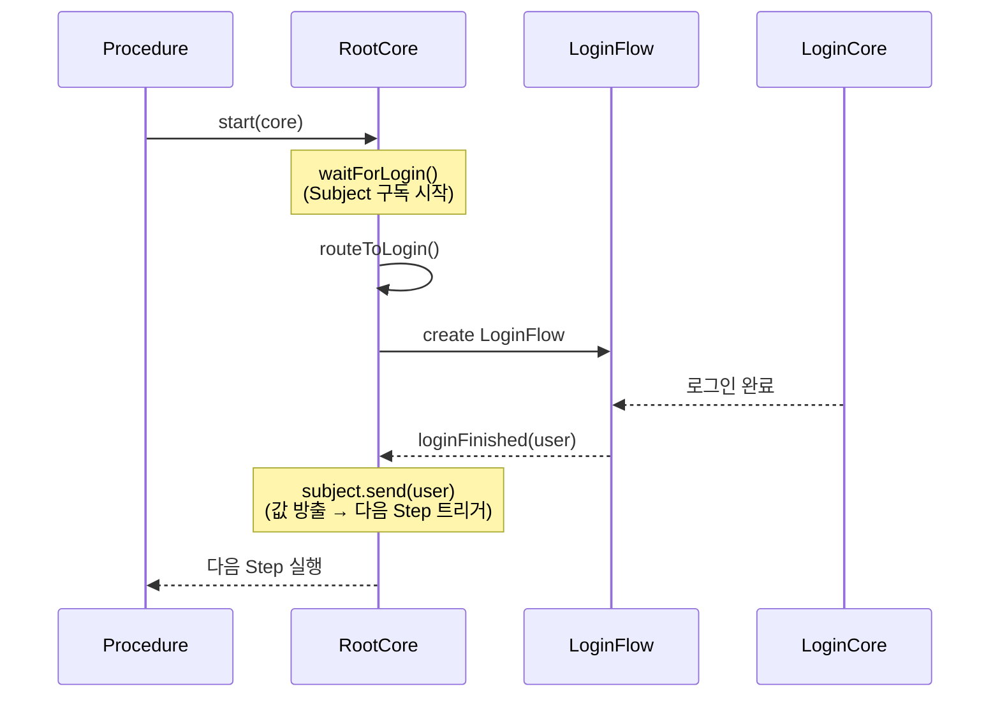

# Procedure(Workflow) 가이드

Procedure는 RIBs의 Workflow와 유사한 개념으로, 여러 CoreFlow를 거치는 복잡한 실행 흐름을 선언적으로 정의할 수 있는 기능입니다.
Combine 기반으로 구현되어 있으며, Step 프로토콜을 통해 각 단계의 실행과 다음 단계로의 전환을 타입 안전하게 관리합니다.

# 구성요소 설명

## Procedure

### 책임

- 워크플로우 정의: 여러 Step을 체이닝하여 전체 실행 흐름을 선언적으로 정의합니다.
- 워크플로우 실행: `start(_:)` 메서드를 통해 정의된 워크플로우를 실행합니다.
- 생명주기 관리: 워크플로우의 시작과 종료를 관리하며, 완료 콜백을 지원합니다.

### 주요 메서드

| 메서드 | 설명 |
|--------|------|
| `onStep(_:)` | 첫 번째 Step을 정의하고 `ProcedureStep`을 반환합니다. |
| `start(_:onProcedureFinish:)` | RootStep을 구현한 객체를 전달하여 워크플로우를 시작합니다. |

### 코드 예시

- 프레임워크: `Sources/CoreFlow/Procedure/Procedure.swift`
- 샘플 구현: `Sample/Sample/Sources/Procedure/DefaultProcedure.swift`

## ProcedureStep

### 책임

- Step 체이닝: `onStep(_:)` 메서드를 통해 다음 Step으로의 전환을 정의합니다.
- 스트림 관리: Combine Publisher를 사용하여 Step 간 데이터 전달을 관리합니다.
- 워크플로우 종료: `finalStep(_:)` 메서드를 통해 마지막 Step을 정의하고 워크플로우를 완료합니다.

### 주요 메서드

| 메서드 | 설명 |
|--------|------|
| `onStep(_:)` | 다음 Step을 정의하고 새로운 `ProcedureStep`을 반환합니다. |
| `finalStep(_:)` | 마지막 Step을 정의하고 워크플로우를 완료합니다. |

### 코드 예시

- 프레임워크: `Sources/CoreFlow/Procedure/Procedure.swift`

## Step Protocol

### 책임

- Step 인터페이스 정의: 각 Step에서 수행할 작업과 다음 Step으로 전달할 데이터를 정의합니다.
- Core 확장 지점: Core가 채택하여 실제 Step 로직을 구현합니다.

### 설계 규칙

- 각 Step 메서드는 `AnyPublisher<(NextStep, Value), Never>`를 반환합니다.
- `NextStep`은 다음 Step 프로토콜 타입, `Value`는 다음 Step에 전달할 데이터입니다.
- 마지막 Step 메서드는 반환값 없이 최종 동작만 수행합니다.

### 코드 예시

- 샘플 구현: `Sample/Sample/Sources/Root/RootCore.swift` (RootProcedureStep 프로토콜 및 구현)

# Step 진행 메커니즘

Step의 진행은 Core 내부에 선언된 Publisher를 통해 제어됩니다.

## 동작 원리

1. Core 내부에 Step 완료를 알리기 위한 Subject(Publisher)를 선언합니다.
2. Step 메서드는 해당 Subject를 구독하는 Publisher를 반환합니다.
3. 하위 CoreFlow의 작업이 완료되면 Listener를 통해 Core에 알립니다.
4. Core는 Listener 메서드에서 Subject에 값을 방출(send)합니다.
5. Subject가 값을 방출하면 다음 Step으로 자동 전환됩니다.

## 시퀀스 다이어그램

## 핵심 개념

- **Subject**: Core 내부에서 Step 완료 시점을 제어하는 Publisher입니다.
- **Listener**: 하위 CoreFlow가 작업 완료를 상위 Core에 알리는 인터페이스입니다.
- **값 방출**: Subject가 값을 방출하면 Procedure의 다음 Step이 자동으로 실행됩니다.

### 코드 예시

- 샘플 구현: `Sample/Sample/Sources/Root/RootCore.swift` (Subject 및 Listener 구현)

# Procedure 사용 플로우

## 1. Step 프로토콜 정의

각 Step에서 수행할 작업을 프로토콜로 정의합니다.

## 2. Procedure 클래스 정의

`Procedure<RootStep>`을 상속하고 `init()`에서 Step 체인을 구성합니다.

## 3. Core에서 Step 프로토콜 구현

Step 프로토콜을 Core의 extension으로 구현합니다.

## 4. Procedure 실행

적절한 시점에 Procedure를 생성하고 `start(_:)`로 실행합니다.
